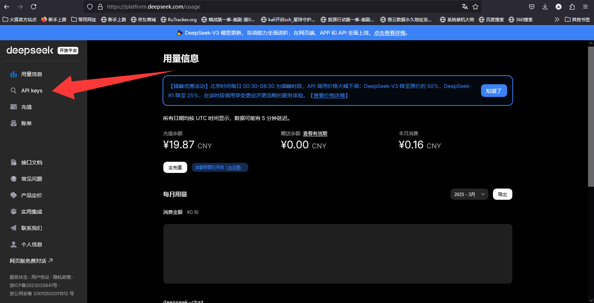
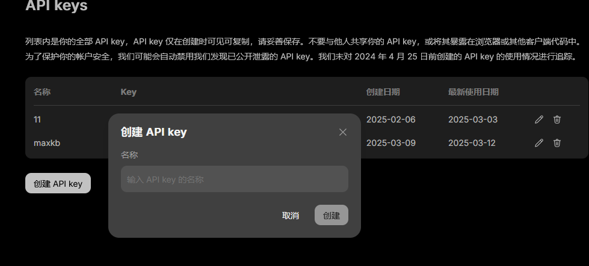
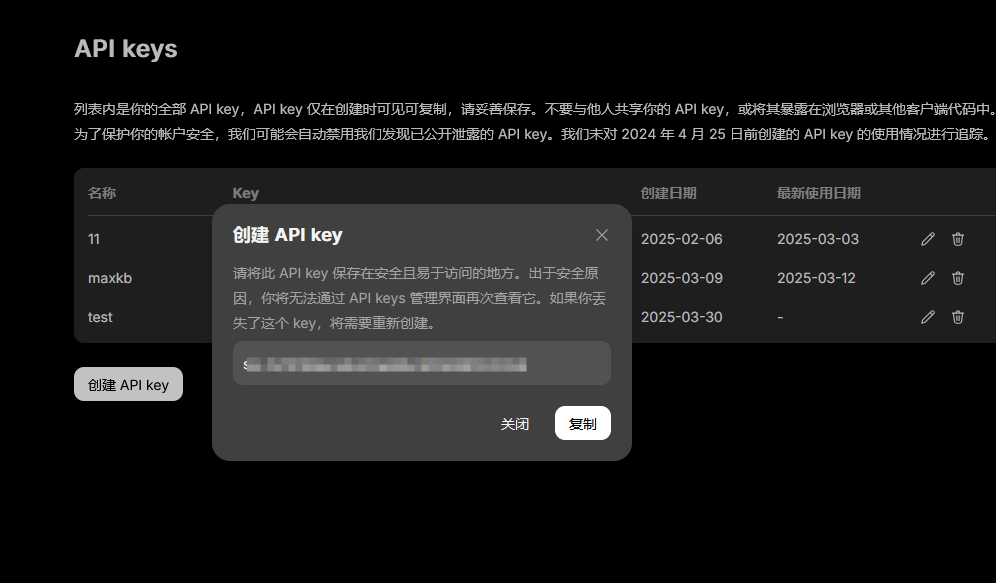
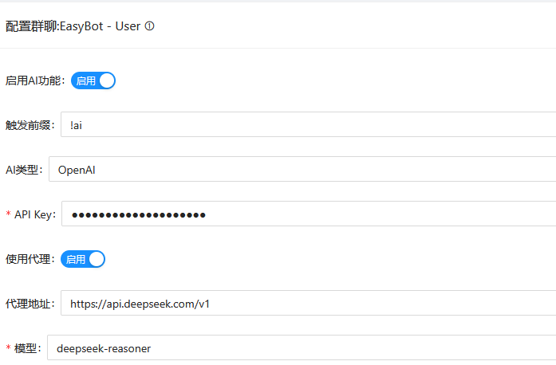
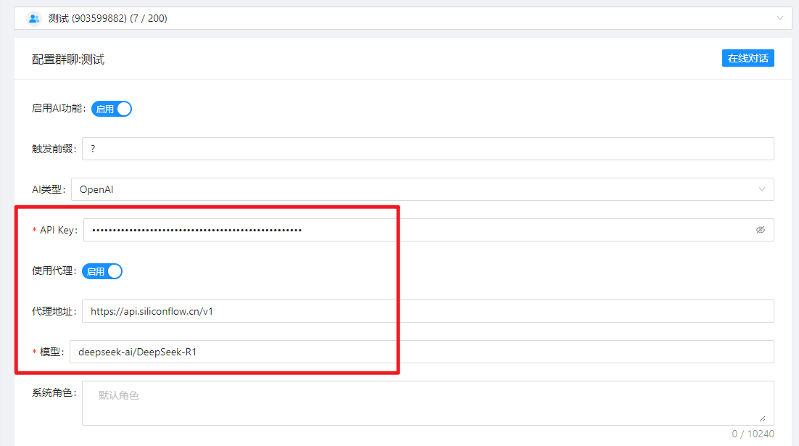

## 注册

:::info 注册地址
[点我-> DeepSeek 注册](https://platform.deepseek.com/)  
:::
:::info 优惠活动
【错峰优惠活动】北京时间每日 00:30-08:30 为错峰时段，API 调用价格大幅下调：DeepSeek-V3 降至原价的 50%，DeepSeek-R1 降至 25%，在该时段调用享受更经济更流畅的服务体验
:::
## 获取 API Key

:::tip 注意
注册完毕后点击此处打开 ``API keys`` 页面,或你也可以 [👉 点我 👈](https://platform.deepseek.com/api_keys) 打开 ``API keys`` 页面

:::

点击`创建 API key`,名称随便写

创建后鼠标点击复制即可复制密钥

## 配置

选择AI类型为`OpenAI`

:::tip 注意
勾选`使用代理`      
代理地址: `https://api.deepseek.com/v1`       
在ApiKey填入刚刚复制的变量      
模型名称填`deepseek-reasoner` 或者 ``deepseek-chat``
:::

:::tip
``deepseek-chat`` 模型已全面升级为 ``DeepSeek-V3``   
``deepseek-reasoner`` 是 **DeepSeek** 最新推出的推理模型 ``DeepSeek-R1``
:::

