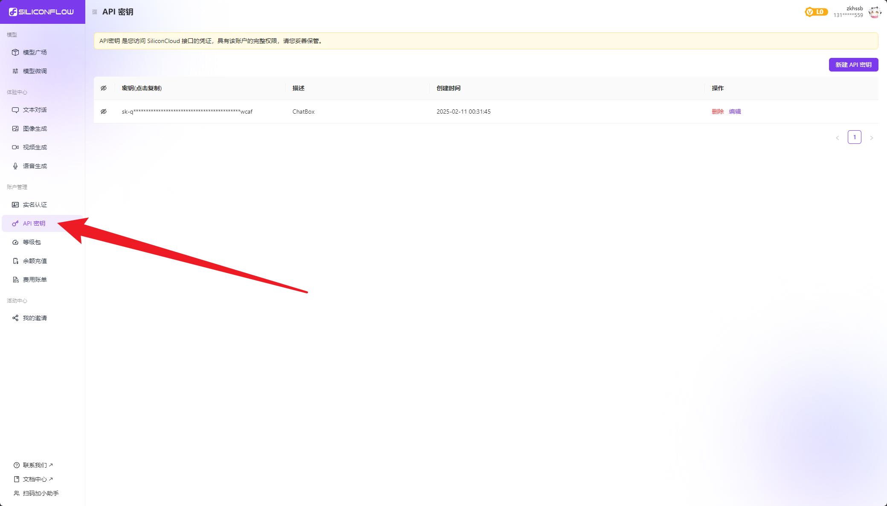
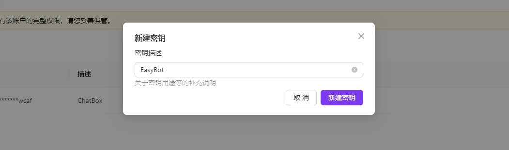
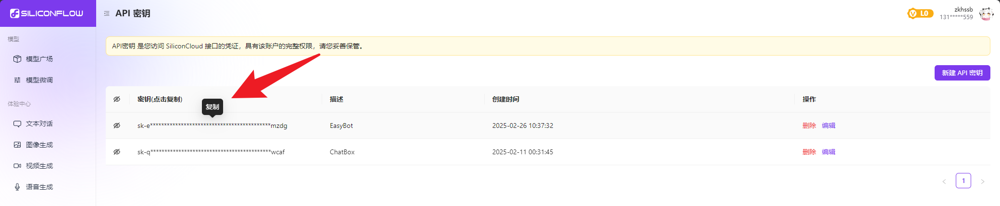
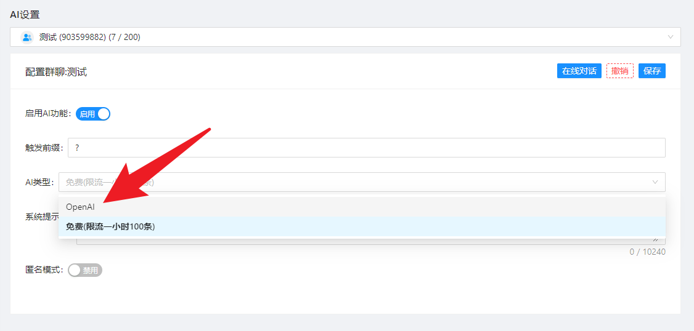
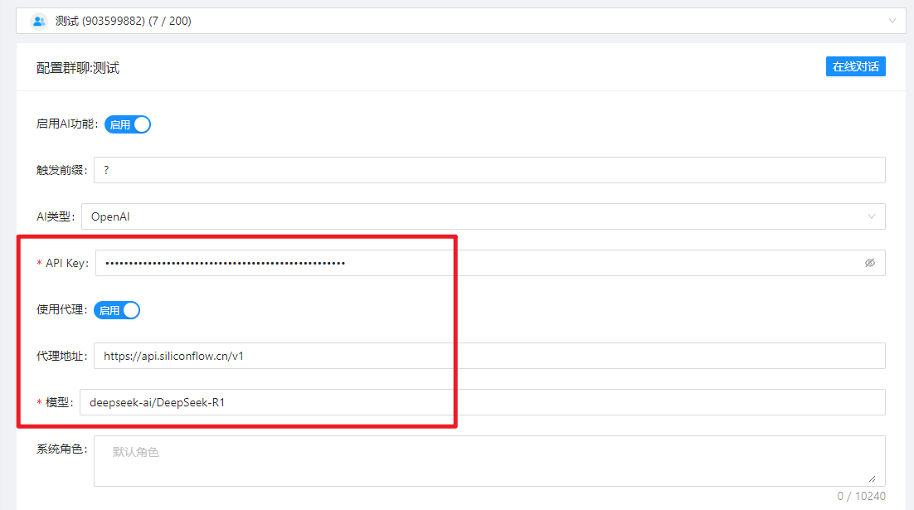
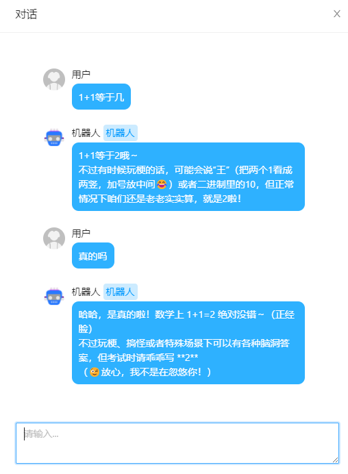

:::tip
由于本教程以DeepSeek示例为示例教程
:::

## 注册

:::info 注册地址
[点我-> SiliconFlow 注册](https://cloud.siliconflow.cn/i/6GEUSkkl)  
使用邀请码`6GEUSkkl`注册可获得`14`元的免费调用额度
:::

## 获取 API Key

:::tip 注意
注册完毕后点击此处打开 ``APIKey`` 页面,或你也可以 [👉 点我 👈](https://cloud.siliconflow.cn/account/ak) 打开 ``ApiKey`` 页面

:::

右上角点击`新建 API 密钥`,描述随便写

创建后鼠标悬浮到密钥点击即可复制密钥

## 配置

选择AI类型为`OpenAI`

:::tip 注意
勾选`使用代理`      
代理地址: `https://api.siliconflow.cn/v1`       
在ApiKey填入刚刚复制的变量      
模型名称填`deepseek-ai/DeepSeek-R1`

:::

