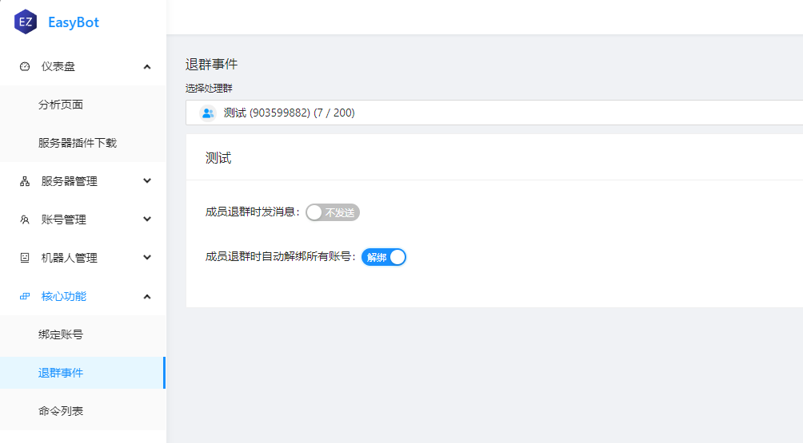

:::tip 介绍
绑定是**EasyBot**的核心功能，用户需要通过**绑定账号**来让玩家账号与社交帐号产生关联。
:::

## 绑定账号

:::info 模式
绑定账号有两种模式      
- **双向验证模式** 用户在服务器获取验证码，在群内输入验证码，即可完成绑定。   

    - 
    - 
- **社交平台信任模式** 用户可以直接在群内输入游戏名绑定。
:::

## 强制绑定

:::tip 介绍
强制绑定是一个列表选项, 将你要求强制绑定的服务器加入到列表中, 那么这个服务器将强制要求绑定。   

在强制绑定的服务器中有以下限制: 
    - 玩家必须绑定账号才能进入服务器。
    - 玩家通过某种方式解绑后会被踢出服务器。
    - 玩家解绑后无法进入服务器。
:::

### 自定义绑定踢出消息

可以通过**配置**来修改踢出消息，两种模式都有不同的配置项。

## 解绑

解绑是一个可选项，用户可以通过**解绑**来解除绑定。

:::danger 注意
解除绑定后,如果服务器属于**强制绑定**用户会被踢出服务器

:::

## 退出时自动解除绑定

在**核心事件** -> **退群事件** 可以选择**成员退群时自动解绑所有账号**。

## 查询绑定信息

:::tip 介绍
管理员或用户可以通过**命令**来查询绑定的信息。
:::

:::info 查询自己的绑定
**关键词** **我的绑定**

:::

:::info 查询别人的绑定
**关键词** **查**
- 查 `@用户`
- 查 `玩家名`
- 查 `qq号`
:::

## 修改成员群名片为游戏ID

:::info 注意
此功能在**绑定功能** -> **群名片更改**中配置。

- **绑定成功后改名** 用户使用绑定或解绑命令成功后,将群名片修改为他绑定的账号 (多个将用空格分割,超出最大字符将被省略)
- **不允许用户改名** 在用户发消息时检查并更新群名片 (每次发消息都会有一次数据库查询,可能会影响响应速度)

:::