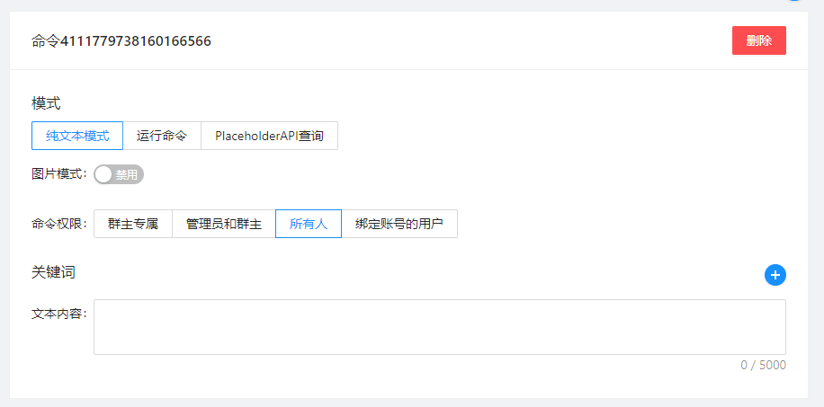
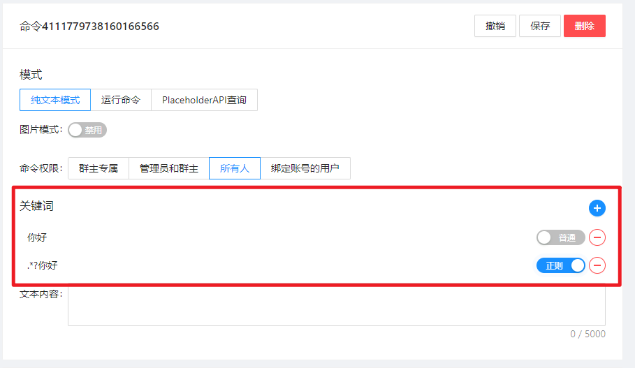
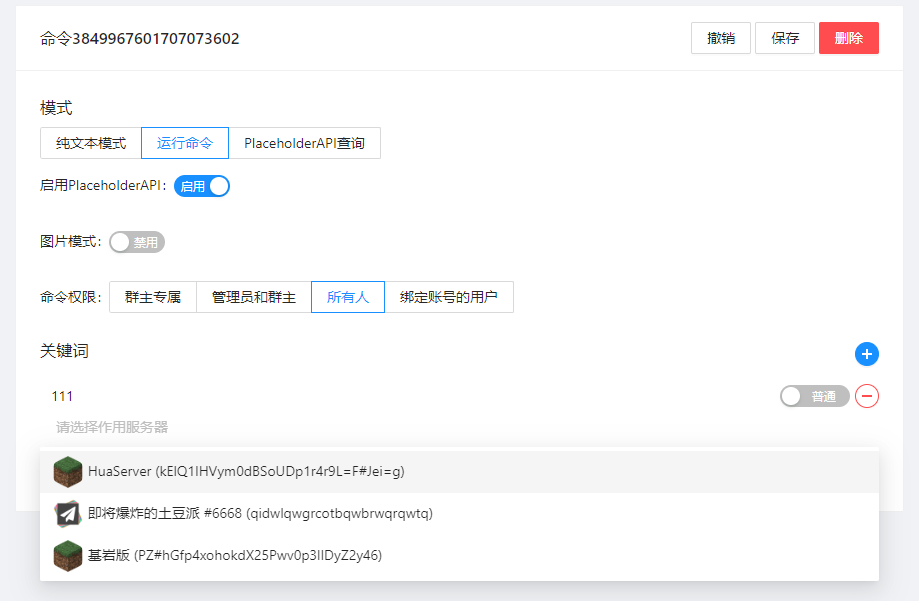

## 有啥作用?

:::tip 介绍
命令列表是一个个可以触发的命令，在用户触发后你可以

- **纯文本模式** 回复一段简单的文本
- **执行命令** 执行一个命令并且返回结果
- **PlaceholderAPI查询** 查询玩家战力、点券信息等数据 
:::

## 命令权限

:::tip 权限
命令执行有四种权限

- **群主专属** 群主可以触发的命令
- **管理员和群主** 群管理可以触发的命令
- **所有人** 所有人可以触发的命令
- **绑定账号的用户** 绑定了账号的用户可以触发的命令

:::

## 关键词

:::tip 关键词
关键词是命令触发的关键词，你可以在命令列表中添加多个关键词，用户触发命令时只要输入其中一个关键词即可触发命令。      
关键词有两种匹配模式

- **精确匹配** 用户输入的命令必须和关键词完全匹配才能触发命令
- **正则模式** 用户输入的命令只要匹配关键词的正则表达式即可触发命令

:::

:::info 关于正则表达式
正则表达式，又称规则表达式,（Regular Expression，在代码中常简写为regex、regexp或RE）        
它是一种文本模式，同时也是计算机科学的一个概念，其中包括普通字符（例如，a 到 z 之间的字母）和特殊字符（称为"元字符"）。     
正则表达式使用单个字符串来描述、匹配一系列匹配某个句法规则的字符串，通常被用来检索、替换那些符合某个模式（规则）的文本。

[引用-百度百科](https://baike.baidu.com/item/%e6%ad%a3%e5%88%99%e8%a1%a8%e8%be%be%e5%bc%8f/1700215)
:::

## 作用服务器

:::tip 作用服务器
作用域是命令执行的时候需要操作的服务器列表，你可以在同一个关键词下指定多个作用服务器，用户触发时会同时查询多个服务器的数据。        
当你的命令非**纯文本模式**时，可以选择**作用服务器**        

:::