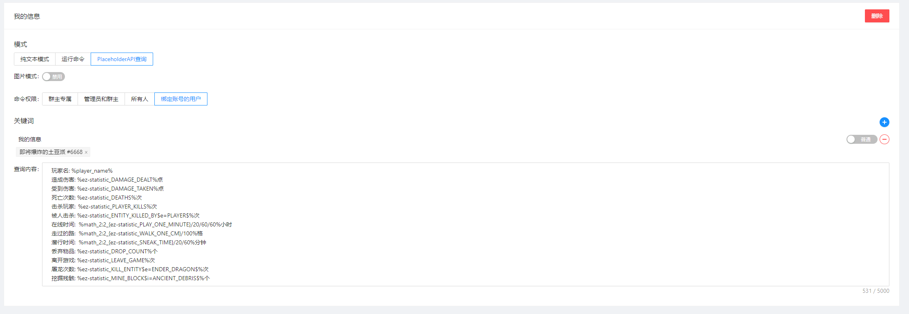
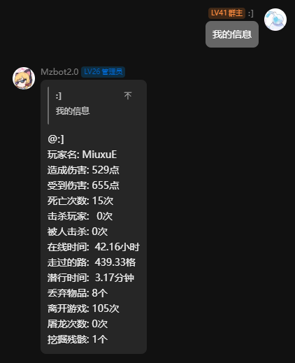
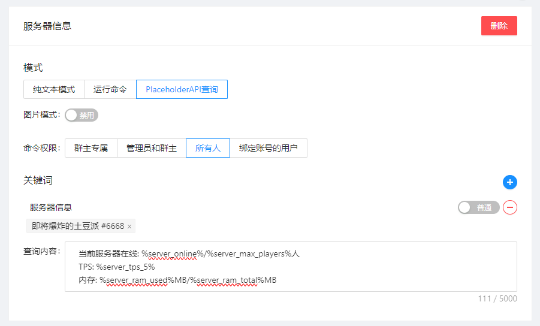

:::info PAPI 介绍
PlaceholderAPI 是一个强大的 Bukkit/Spigot 插件，它允许您通过**占位符**在游戏文本中动态显示实时数据。这些占位符会被自动替换成对应的数值或信息（如玩家名、金钱、血量等）。
:::

:::warning 注意
如果您的服务器没有实现**Bukkit/Spigot API** 或 使用**PlaceholderAPI**不支持的服务端 将无法使用此功能。

一些特定的插件版本可能会有支持**不完全的**占位符变量

- **基岩版** 插件未提供任何占位符变量,无法使用此功能。
- **MCDR** 插件未提供任何占位符变量,无法使用此功能。
  :::

:::danger 注意
部分变量因自身设计特性，在玩家离线时无法**查询**到正确值，需要配合[EzOfflinePAPI](/docs/ezofflinepapi/intro.mdx)离线变量插件来解决。
:::

:::tip 问题
查询时使用的是玩家绑定的第一个账号，如果玩家绑定了多个游戏账号，将使用第一个账号。
:::

## 介绍

:::info 一键配置
如果你是一个小白服主,想要使用此功能又不想折腾,我建议你在服务器一键执行这些命令。

```cmd
papi ecloud download Player
papi ecloud download Server
papi ecloud download Math
papi reload
```

- ``Player`` 变量用来查询玩家基本信息,比如名字等
- ``Server`` 变量用来查询服务器基本信息,比如在线人数、TPS等
- ``Math`` 变量用来进行数学计算,如果你能获得玩家死亡次数、击杀次数 可以用词此变量计算玩家击杀率。
:::

### 例: 战绩可查

:::info 依赖
EasyBot最新版本提供一份允许离线查询[👉玩家统计信息的变量(仅限1.15+服务器)👈](/docs/easybot/features/player_state.md)，借用此套变量，你可以查询很多玩家在服务器里的数据。

# 依赖
为了计算在线时间，你需要安装``Math``变量

```cmd
papi ecloud download Math
papi reload
```

- **Math** 变量用来进行数学计算,如果你能获得玩家死亡次数、击杀次数 可以用词此变量计算玩家击杀率。
:::

:::tip 注意
查询玩家信息(要指定玩家)的操作,必须将命令权限设置为**绑定账号的用户**, 否则查询不到任何数据!
:::

```text
玩家名: %player_name%
造成伤害: %ez-statistic_DAMAGE_DEALT%点
受到伤害: %ez-statistic_DAMAGE_TAKEN%点
死亡次数: %ez-statistic_DEATHS%次
击杀玩家: %ez-statistic_PLAYER_KILLS%次
被人击杀: %ez-statistic_ENTITY_KILLED_BY$e=PLAYER$%次
在线时间: %math_2:2_{ez-statistic_PLAY_ONE_MINUTE}/20/60/60%小时
走过的路: %math_2:2_{ez-statistic_WALK_ONE_CM}/100%格
潜行时间: %math_2:2_{ez-statistic_SNEAK_TIME}/20/60%分钟
丢弃物品: %ez-statistic_DROP_COUNT%个
离开游戏: %ez-statistic_LEAVE_GAME%次
屠龙次数: %ez-statistic_KILL_ENTITY$e=ENDER_DRAGON$%次
挖掘残骸: %ez-statistic_MINE_BLOCK$i=ANCIENT_DEBRIS$%个
```




### 例: 服务器信息

:::info 依赖
借助``Server``变量,你可以查询一些服务器的信息

```cmd
papi ecloud download Server
papi reload
```

- **Server** 变量用来查询服务器基本信息,比如在线人数、TPS等 
:::

```text
当前服务器在线: %server_online%/%server_max_players%人
TPS: %server_tps_5%
内存: %server_ram_used%MB/%server_ram_total%MB
```


