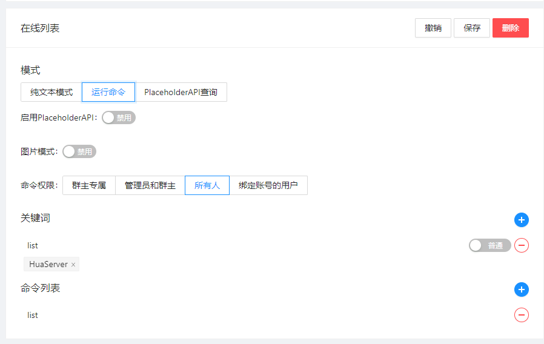
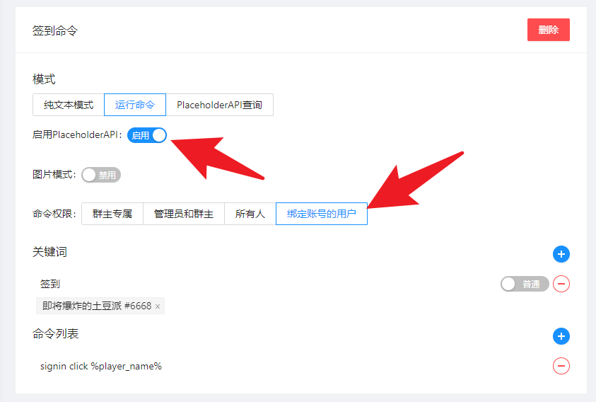
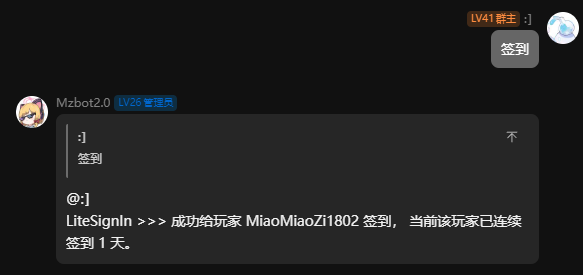

命令触发后，可以在指定服务器运行命令。

:::info 注意
关于运行命令时查询变量的 **玩家账号** 选择，目前 **EasyBot** 只会用单个账号作为查询，选择的账号则是玩家第一次绑定的账号。
:::

:::tip 相关知识
**[关键词 (点我查看介绍)](../#关键词)**  
**[作用服务器 (点我查看介绍)](../#作用服务器)**
:::




## 高阶玩法

:::info 介绍
配合 `PlaceholderAPI`,可以执行一些简单的命令,比如通过命令签到。
:::

:::info PAPI 介绍
`PlaceholderAPI` 是一个强大的 **Bukkit/Spigot 插件**，它允许您通过**占位符**在游戏文本中动态显示实时数据。这些占位符会被自动替换成对应的数值或信息（如玩家名、金钱、血量等）。
:::

:::warning 注意
如果您的服务器没有实现**Bukkit/Spigot API** 或 使用**PlaceholderAPI**不支持的服务端 将无法使用此功能。

一些特定的插件版本可能会有支持**不完全的**占位符变量

- **基岩版** 插件未提供任何占位符变量,固无法使用此功能。
- **MCDR** 插件未提供任何占位符变量,固无法使用此功能。
  :::


### 例: 签到命令

:::tip 环境
**服务器** `Paper-1.21.1`  
**插件** `EasyBot-Bukkit-2.0.4`

**依赖** `PlaceholderAPI`       
**安装的变量**
    ``/papi ecloud download Player``

**插件** [LiteSignIn](https://www.minebbs.com/resources/litesignin-1-7-1-21.7337/)

:::

:::info
根据`LiteSignIn`插件的文档，可以使用 `/signin click [玩家名]` 给玩家进行签到。        
创建一个命令，在命令中添加 `/signin click %player_name%`，并设置作用服务器为 `需要签到的服务器`。      





# 注意
- 需要启用`PlaceholderAPI`
- 命令权限**必须**改为**绑定账号的用户** 否则命令无法找到用户绑定的玩家账号

`%player_name%` 是 PlaceholderAPI 的插件占位符, 安装好了 PlaceholderAPI 插件后, 你还需要安装这个变量。

```command
/papi ecloud download Player
/papi reload
```

:::


