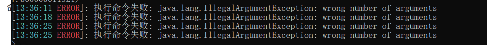

# 执行命令失败

:::tip 提示
如果你遇到**执行命令失败**或服务端报错`Can not find runCommand method`或者是`wrong number of arguments`之类的报错，此教程能帮助你修复这个问题。


:::

## 确认问题

该问题是`EasyBot`无法在指定服务器找到合适的方法来执行命令导致的。

## 解决方法

你需要手动为EasyBot配置原生RCON接口。

:::info 修改插件配置文件
你需要先修改`config.yml`文件，在这之前请先想一个`Rcon`密码，这里我们假设密码是`1234`


```yml
adapter:
  native_rcon:
    use_native_rcon: true   # 改为true
    address: "127.0.0.1"    # 默认
    port: 25575             # 默认
    password: "1234"        # 服务端的RCON密码
```
:::

:::info 修改服务器配置文件
打开服务器的`server.properties`文件，将`enable-rcon`改为`true`，将`rcon.password`改为你之前设置的密码。

```properties
enable-rcon=true
rcon.password=1234
```
:::

完成上述配置后, 重启服务器, 如果发现日志显示`【原生RCON接口】连接成功` 表示成功。
