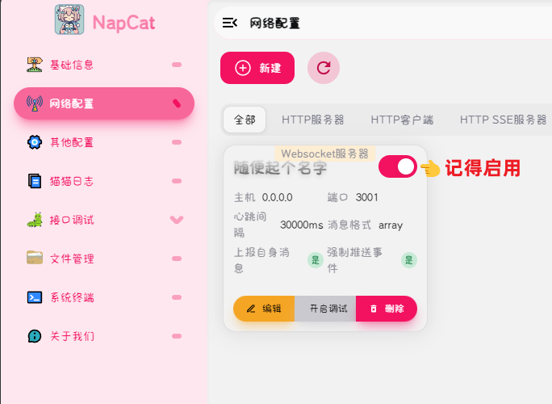

:::info 作者
在此需要感谢“倒霉蛋花花”大佬为我们提供的 docker 镜像
:::

:::warning 注意
此镜像由社区提供，可能存在一些不兼容问题，如果你遇到问题，请[👉加群👈](https://qm.qq.com/q/CVuIuNRzeE)
:::

:::warning 注意
Docker镜像更新速度缓慢，不保证是最新版
:::

## 更换源仓库

- 支持 `Debian` / `Ubuntu` / `RHEL` / `CentOS` / `Fedora` 等
- 支持上述基于 `Debian` 与 `Redhat` 系的发行版和及其部分衍生版本，支持拥有相同底层核心的其它发行版

:::tip
使用此脚本请切换至 `root` 用户执行      

两行脚本请选择任意一个使用如果不行再使用另一个，不得一起使用
:::

```bash
bash <(curl -sSL https://cdn.jsdelivr.net/gh/SuperManito/LinuxMirrors@main/DockerInstallation.sh)
```

```bash
bash <(curl -sSL https://raw.githubusercontent.com/yangyzp/wikicc_collection/master/DockerInstallation.sh)
```

### 问题

如果提示 则说明当前未安装 软件包

```bash
sudo yum install -y curl || sudo apt-get install -y curl
```

## Docker Compose 安装

### 方式一：直接下载安装

```bash
curl -L https://get.daocloud.io/docker/compose/releases/download/1.24.0/docker-compose-`uname -s`-`uname -m` > /usr/local/bin/docker-compose
chmod +x /usr/local/bin/docker-compose
docker-compose --version
```

## 部署 EasyBot

:::info 镜像加速
如果你的服务器位于中国大陆内 可以查看这篇文章使用加速服务来拉取镜像 [👉👉访问教程👈👈](https://www.runoob.com/docker/docker-mirror-acceleration.html)
:::

新建目录存放配置文件

```bash
mkdir /opt/EasyBot
cd /opt/EasyBot
```

请使用文件编辑器，新建一个名为 docker-compose.yml 纯文本文件，并填入下列信息

```bash
version: '3'
services:
  easybot:
    image: xrcuor/easybot
    container_name: easybot
    environment:
      - ACCOUNT=123456 # 机器人qq
      - WS_ENABLE=true # 正向 WS
      - TOKEN=1234 # access_token，可以为空
      - WEBUI_TOKEN=wscc # 登录密钥，默认是自动生成的随机登录密码
      - SERVER_HOST=0.0.0.0 # WebSocket服务器地址
      - SERVER_PORT=26990 # WebSocket服务器端口
    restart: always
    volumes:
      - ./napcat/config:/app/napcat/config
      - ./napcat/qq:/root/.config/QQ
      - ./EasyBot:/data
    ports:
      - "6099:6099"
      - "5000:5000"
      - "26990:26990"
```


## 部署容器

确保你是在 `/opt/EasyBot` 目录中并且 `docker-compose.yml` 已经填入步骤三中的内容和保存

使用以下命令进行部署

```bash
docker-compose up -d
```

## 登录

:::warning 注意
如果你是本机部署的话请访问 127.0.0.1:6099/webui/        
如果你和服务器处于同一个内网，请访问:服务器内网 ip:6099/webui/ 如果你的服务器位于公网，且你们不在同一个内网，请使用:服务器公网 ip:6099/webui/       

如果你没有改动过 docker-compose.yml 文件中的登陆密钥        
默认登录密码为 `wscc`

如果您改动过密码,找到`/opt/EasyBot/napcat/config/webui.json`中的`token`
:::

登陆后扫码即可


## 配置WebSocket服务器

在 NapCat 侧边栏选择网络配置,新建一个`Websocket服务器`




## 在主程序连接


## 启用群聊

:::info 注意
**EasyBot** 默认全群关闭，需要手动启用


:::