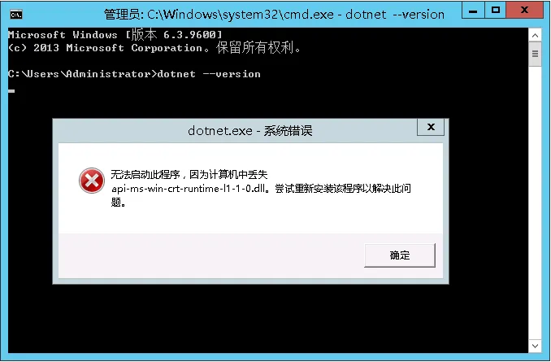
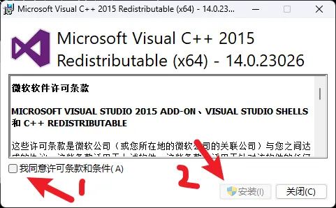
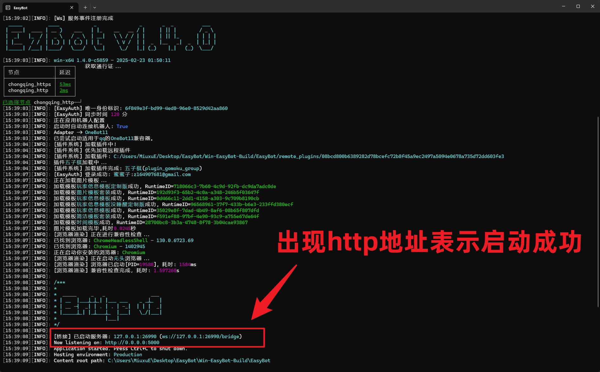
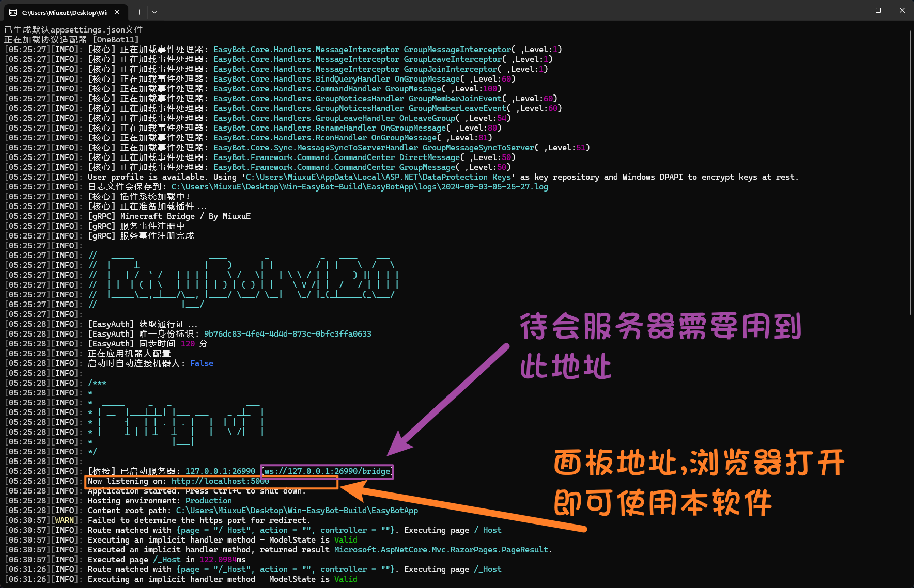

import { CrossPlatformDownloadCard } from "@site/src/components/CrossPlatformFileDownloadList";

### 第一步: 安装运行环境

:::info 注意
EasyBot 基于 **.NET8** **Blazor** 开发  
你需要安装 `.NET8` 的运行环境
:::

:::tip **第一步: 基本运行环境**
[点我下载 .NET 8.0 Runtime (v8.0.4) - Windows x64 Installer ](https://dotnet.microsoft.com/en-us/download/dotnet/thank-you/runtime-8.0.13-windows-x64-installer)
:::

:::tip **第二步: 在线运行环境**
[点我下载 ASP.NET Core 8.0 Runtime (v8.0.4) - Windows x64 Installer ](https://dotnet.microsoft.com/en-us/download/dotnet/thank-you/runtime-aspnetcore-8.0.13-windows-x64-installer)
:::

:::tip **第三步: 旧版本系统需要安装**
[点我下载 NET 4.8 ](https://dotnet.microsoft.com/zh-cn/download/dotnet-framework/thank-you/net48-web-installer)
:::

:::warning 注意
请安装上面的所有环境，不安装将无法打开程序
:::

#### 其他问题

无法运行此程序,因为缺少xxx.dll

出现这种情况说明你缺少 `VC++运行库` ，请安装 `VC++运行库` ，安装完成后重新打开程序即可。

[👉👉👉点我下载VC++2015-2019运行库👈👈👈](https://aka.ms/vs/17/release/vc_redist.x64.exe)

### 第二步：安装程序

<CrossPlatformDownloadCard alistPath="/easybot" detailHref="/download/easybot"/>

确保你已经安装好运行环境，然后下载 **EasyBot** 的安装包，一键安装打开即可。

