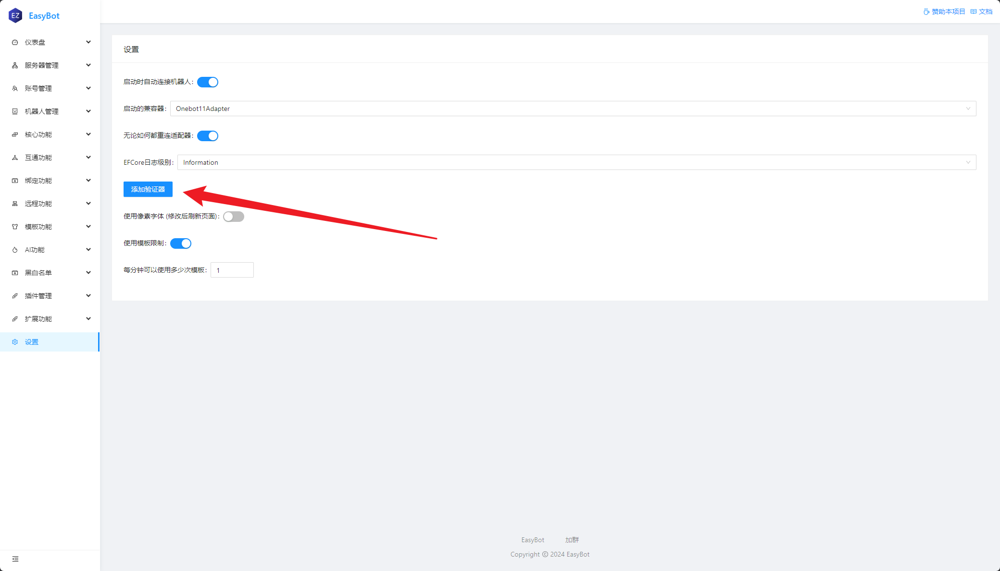

:::tip
EasyBot 目前有两个接口，他们分别是:

- **Bridge** 这是主程序与插件沟通的桥梁
- **面板** 这是主程序设置页面
  :::

## 将 Bridge 部署到公网

:::warning 注意
将Beidge部署到公网时,创建服务器一定要使用自动生成的身份令牌,避免过于简单的密码。
:::

### 修改配置

打开`EasyBot`根目录下的`appsettings.json` 修改 `Bridge` 字段的 `Host` 将 `127.0.0.1` 改为 `0.0.0.0`

```json
{
  "ServerOptions": {
    //highlight-next-line
    "Host": "0.0.0.0",
    "Port": 26990,
    "HeartbeatInterval": "0.00:01:00"
  },
}
```

至此,你已经将Bridge部署到公网了。

:::danger 是否该停止了
如果您是面板服，只需要完成这一步即可，不需要将**面板部署到公网**
:::

***

## 将面板部署到公网

:::warning 注意
出于安全考虑，我们更推荐你在本地配置EasyBot, 而不是将**EasyBot 面板**部署到公网
  :::

### 第一步: 设置密码

:::info
在部署到公网前,请为你的 EasyBot 面板设置一个密码。


:::

### 第二步: 设置配置

打开`EasyBot`根目录下的`appsettings.json` 修改 Endpoints 的地址, 将`127.0.0.1`改为`0.0.0.0`。

```json
{
  "Kestrel": {
    "Endpoints": {
      "web_app": {
        //highlight-next-line
        "Url": "http://0.0.0.0:5000",
        "Protocols": "Http1"
      }
    }
  }
}
```

完成后,你的EasyBot就已经在公网启动了。
