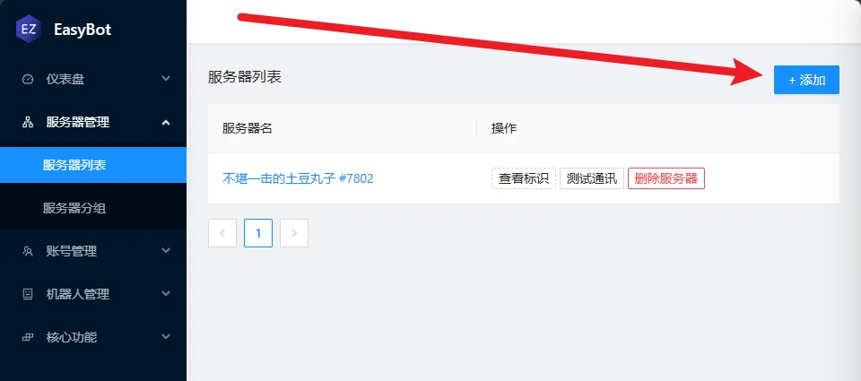
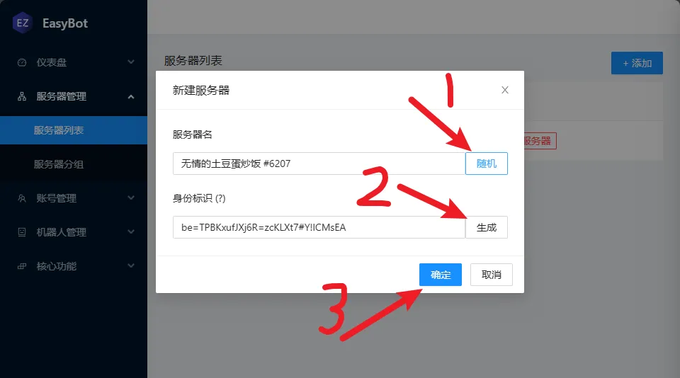
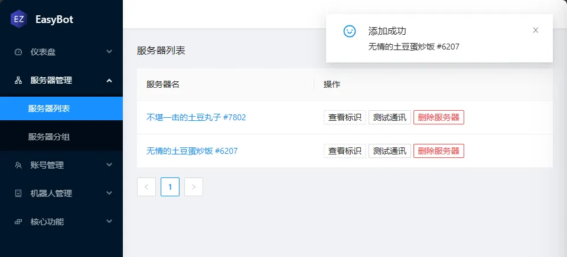
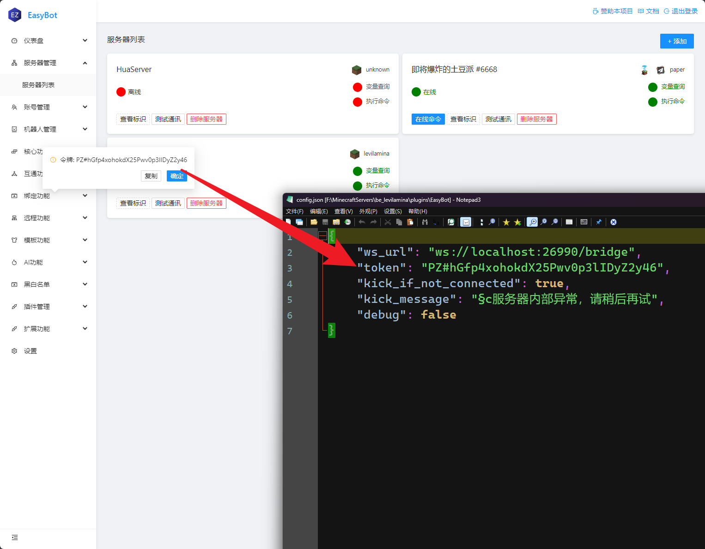
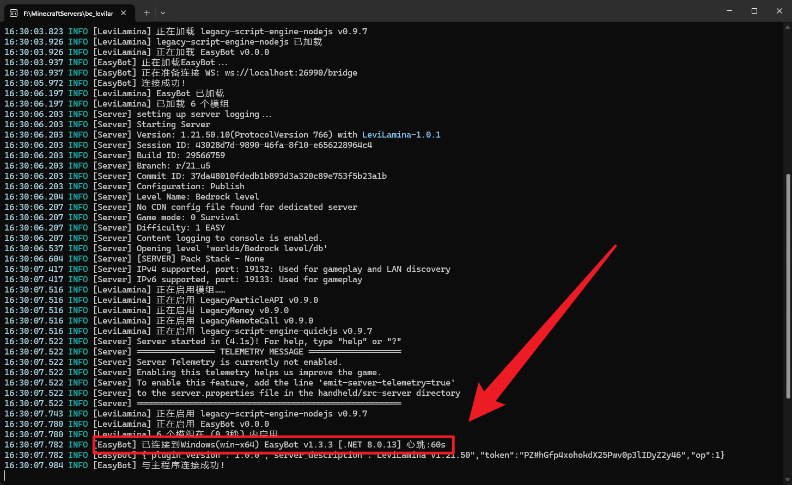
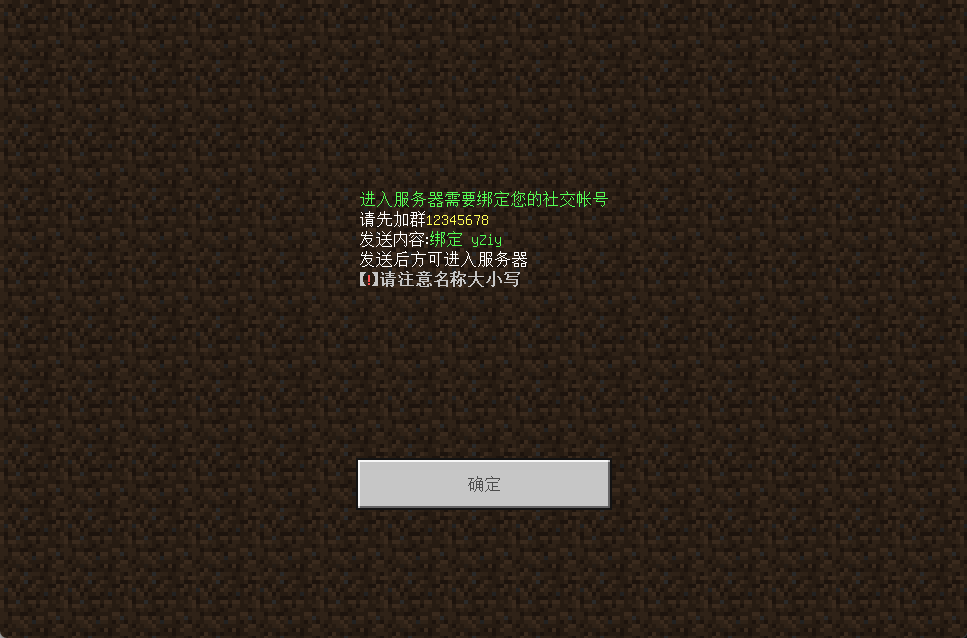

import { FileDownloadCard } from "@site/src/components/FileDownloadList";

:::danger 注意
基岩版插件目前正在测试阶段,可能会有部分功能无法使用。
:::

:::info 依赖
`legacy-script-engine-quickjs` 基岩版服务器基于 QuickJS 引擎
:::

:::tip 信息
**测试环境** `LeviLamina v1.21.50`
:::

## 支持表

| 功能                     | 是否支持 | 原因                                  |
| :----------------------- | :------: | :------------------------------------ |
| PlaceholderAPI           |    ❌    | 基岩版没有,后续可能会兼容部分常用变量 |
| 使用命令绑定             |    ❌    | 暂不支持,会有的会有的                 |
| 命令重载                 |    ❌    | 暂不支持,会有的会有的                 |
| 使用命令消息同步         |    ❌    | 暂不支持,会有的会有的                 |
| 命令执行                 |    ✅    | -                                     |
| 绑定,强制绑定 双向、信任 |    ✅    | -                                     |
| 消息同步                 |    ✅    | -                                     |
| 死亡同步                 |    ✅    | -                                     |
| 进入退出同步             |    ✅    | -                                     |

## 安装依赖

进入服务端根目录使用如下命令安装依赖
```bash
lip install gitea.litebds.com/LiteLDev/legacy-script-engine-quickjs
```

## 安装插件

<FileDownloadCard alistPath="/easybot_be" title="EasyBot 基岩版" detailHref="/download/easybot_plugin"/>

将插件压缩包内的`EasyBot`目录解压到服务端`plugins`目录中,随后启动服务器

## 配置

第一次启动会无法连接到服务器,你需要添加服务器

回到主程序的服务器列表，点击 `+添加` 添加服务器。





请打开`./plugins/EasyBot/config.json`文件，将身份令牌的值写入`token`字段



## 验证

启动你的基岩版服务器，出现以下信息表示插件安装成功



## 强制绑定踢出消息

由于目前无法使用命令绑定，所以需要使用强制绑定。
众所周知基岩版踢出消息最大限制五行,你需要将强制绑定踢出消息缩短，以下是我们推荐的模板:

```text
&f&a进入服务器需要绑定您的社交帐号
&f请先加群&e12345678
&f发送内容:&a绑定 #code
&f发送后方可进入服务器
&7&l【&c&l!&7&l】请注意名称大小写
```

