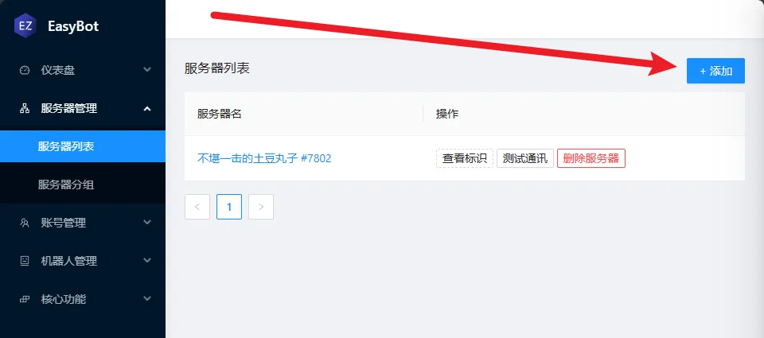

import { FileDownloadCard } from "@site/src/components/FileDownloadList";

:::tip 提示
- **服务器环境** `CatServer - 1.12.2`     
- **支持的版本** `≥1.9`
:::

:::info 软依赖 (可以安装可以不安装的意思)
- `SkinsRestorer` 用于显示离线玩家皮肤
- `Geyser` 支持基岩版
- `Floodgate` 支持设置忽略基岩版前缀
- `PlayerChat` 兼容
- `RedisChat` 兼容


:::

:::info 步骤
- **1.添加服务器** 在主程序添加服务器获取token
- **2.添加插件** 在插件列表添加插件
- **3.配置服务器** 在服务器设置token
:::

## 在软件添加服务器

回到主程序的服务器列表，点击 `+添加` 添加服务器。




## 添加插件

<FileDownloadCard alistPath="/easybot_bukkit" title="EasyBot Bukkit" detailHref="/download/easybot_plugin"/>

下载插件，放到服务器的 `plugins` 目录下。


## 配置插件

:::info
先启动服务器，等待配置文件生成。    
在 `config.yml` 文件中配置服务器信息。
:::


## 设置Token

```yaml
service:
  token: "设置为你的Token"
```


## 启动服务器

启动服务器后，插件会自动连接服务器，如果看到这条消息，说明插件已经连接成功。

