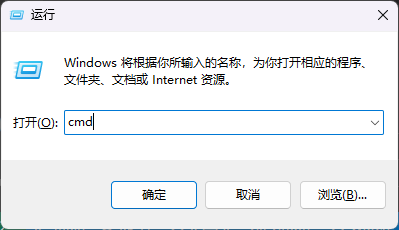
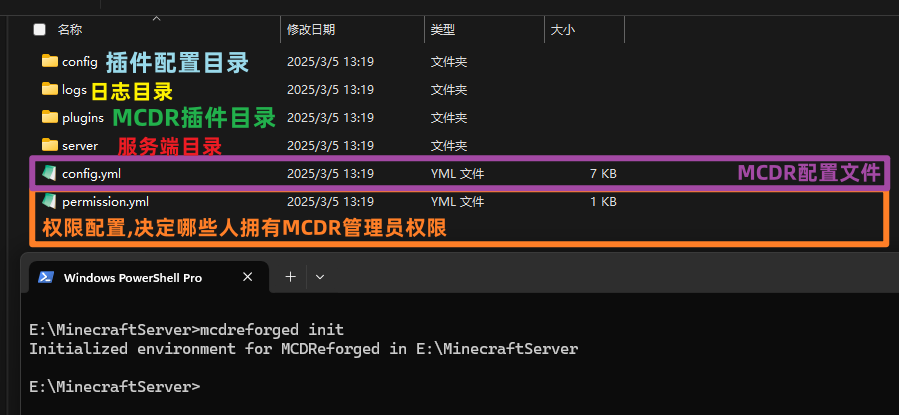
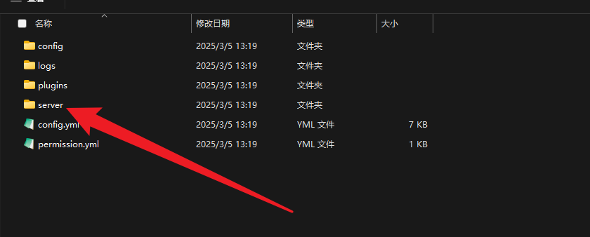
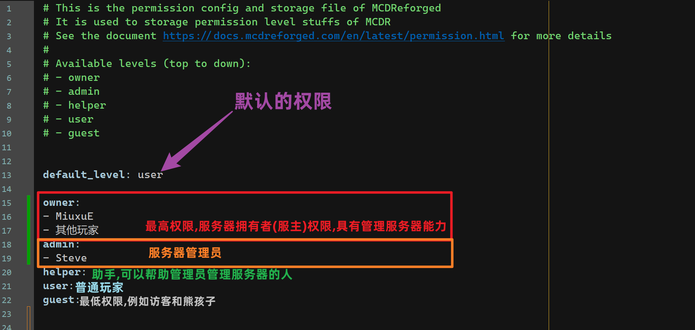
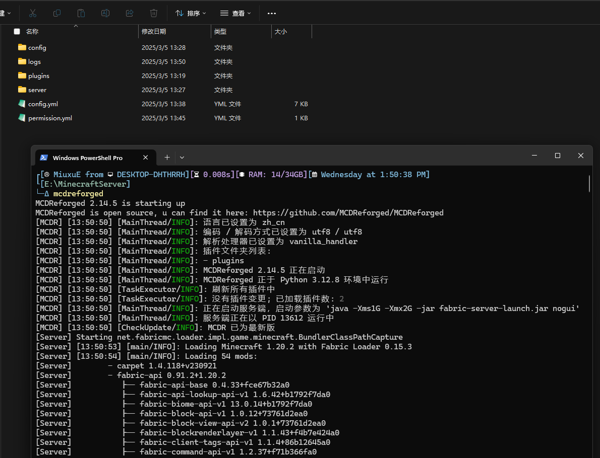
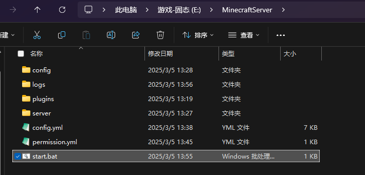
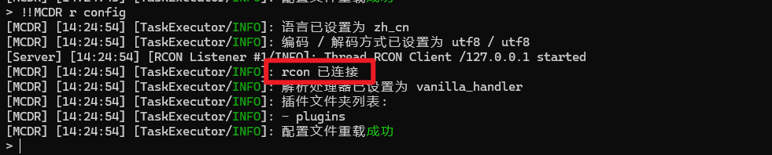
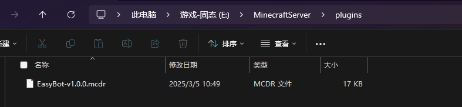
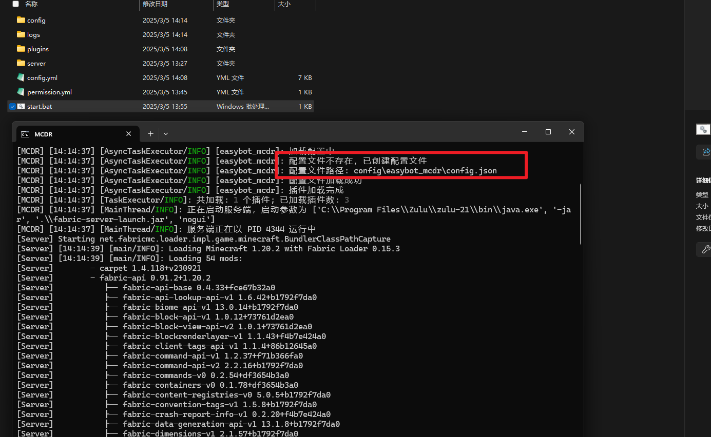
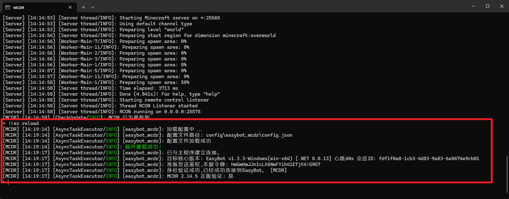

import { FileDownloadCard } from "@site/src/components/FileDownloadList";

:::info 什么是 MCDR
 **MCDReforged (MCDR)** 是一个管理 Minecraft 服务器的工具，拥有自定义插件系统。完全无需修改 Minecraft 服务器本身
:::

## 概述

得益于 **MCDR** 的特性, EasyBot 可以兼容原版服务端, 同时也可以在 `Forge/Fabric` 等 Mod 服务端上运行。

### 功能表

:::info 注意
因为插件**工作原理**与实现**原理不同**部分功能无法做到`100%`兼容
:::

:::warning 注意
EasyBot的执行命令功能依赖`RCON`,如果你的服务器版本小于`1.9` 将无法使用命令执行功能,但是其他基本功能可以使用!

**无法使用RCON会导致以下问题**:
- ❌ 命令执行功能无法使用
- ❌ 因为特性,踢出玩家时的消息只能显示一行文本
:::

| 特性 | 原因 |
| :-------------- | ---------------------------------------------- |
| 死亡同步 | ❌ 不同服务器实现原理不同,无法稳定判断死亡原因 |
| PlaceholderAPI | ⚠ 不完全支持: 目前只支持 `%player_name%` |

| 特性             | MCDR 解决方案 |
| :--------------- | ------------- |
| 消息同步         | ✅ 支持       |
| 进入退出通知     | ✅ 支持       |
| 强制绑定         | ✅ 支持       |
| 使用命令绑定账号 | ✅ 支持       |
| 命令模式消息同步 | ✅ 支持       |
| 热重载           | ✅ 支持       |
| 执行命令         | ✅ 支持       |
| 绑定时执行命令   | ✅ 支持       |
| 联动原版白名单   | ✅ 支持       |
| 解绑时执行命令   | ✅ 支持       |

## MCDR安装

:::info
以下内容为小白服主提供, 如果你已经完成了`MCDR`的安装,请跳到下一步。
:::

<details>
<summary>点击展开</summary>

### 安装环境

:::tip 安装依赖
**MCDR**基于 `Python` 开发, 需要安装 `Python` 环境才能使用。

- 我们提供一个适用于`windows`的`python-3.12.8`安装包
- [👉 点我下载 👈](https://files.inectar.cn/d/ftp/tools/python-3.12.8-amd64.exe)
  :::

:::tip 提示
Windows 用户,按下 `win+r` 输入 cmd,即可打开控制台


:::

### 安装 MCDR

打开控制台, 输入以下命令

```bash
pip install -i https://pypi.tuna.tsinghua.edu.cn/simple mcdreforged
```

#### 1.新建文件夹

新建一个文件夹

#### 2.初始化 MCDR

:::tip 提示

- Windows11 用户，右键文件夹空区域，使用`在终端打开`执行下面的命令。
- Win10 或以下用户,在文件夹空白区域按住`Shift+右键`选择`在此处打开PowerShell窗口`
- 如果你的电脑没有以上的快捷键，可以尝试使用`cmd`执行执行命令，但是执行之前需要使用`cd`命令进入文件夹
  :::

使用`mcdreforged init`生成配置文件

```bash
mcdreforged init
```

:::tip
MCDR 将生成一个如下所示的默认文件结构


:::

#### 3.将服务端移动

将你的服务端,移动到`server`目录下



### 配置 MCDR

安装好后,你需要配置`config.yml`里的启动配置和`RCON`

:::tip

- 配置文件位置如上图所示
- 打开后按照步骤设置即可
  :::

#### 1.切换语言为中文

```yaml
# The language that MCDR will use to display information
# Examples: "en_us", "zh_cn", "zh_tw"
language: "zh_cn"
```

#### 2.设置启动脚本

你需要将脚本改为你服务器的启动脚本, 具体请参考自己的启动脚本。

:::tip
这个脚本的工作路径取决于上面的配置`working_directory`
:::

```yaml
# The command to start the server, it can be a string or a list of string
# (shell mode) If it's a string, the command will be executed as a shell command in a shell environment
# (exec mode) If it's a list of strings, the command will be executed directly
# Example command for starting a Minecraft server:
#   'java -Xms1G -Xmx2G -jar minecraft_server.jar nogui'                        (shell mode)
#   ['java', '-Xms1G', '-Xmx2G', '-jar', 'minecraft_server.jar', 'nogui']       (exec mode)
start_command: "java -Xms1G -Xmx2G -jar fabric-server-launch.jar nogui"
```

#### 3.设置处理器

不同类型的服务器设置不同的处理器。

| 处理器名称         | 描述                                                              |
| ------------------ | ----------------------------------------------------------------- |
| vanilla_handler    | 原版类服务端（Vanilla/Carpet/Fabric）                             |
| beta18_handler     | 旧版本原版服务端（适用于 1.7 及更早版本，包括 beta1.8）           |
| bukkit_handler     | Bukkit/Spigot 服务端（1.14 以下版本），全版本 Paper/Mohist 服务端 |
| bukkit14_handler   | Bukkit/Spigot 服务端（1.14 及以上版本）                           |
| forge_handler      | Forge 服务端                                                      |
| cat_server_handler | CatServer 服务端                                                  |
| arclight_handler   | Arclight 服务端                                                   |
| bungeecord_handler | Bungeecord 代理端                                                 |
| waterfall_handler  | Waterfall 代理端                                                  |
| velocity_handler   | Velocity 代理端                                                   |

```yaml
# The handler to the specific way to parse the standard output text of the server and the correct command for server control
#   vanilla_handler    , for Vanilla / Carpet / Fabric server
#   beta18_handler     , for Vanilla server in legacy versions, e.g. < 1.7, or even beta1.8
#   bukkit_handler     , for Bukkit / Spigot server with Minecraft version below 1.14, and Paper / Mohist server in all version
#   bukkit14_handler   , for Bukkit / Spigot server with Minecraft version 1.14 and above
#   forge_handler      , for Forge server
#   cat_server_handler , for CatServer server
#   arclight_handler   , for Arclight server
#   bungeecord_handler , for Bungeecord server
#   waterfall_handler  , for Waterfall server
#   velocity_handler   , for Velocity server
handler: vanilla_handler
```

至此,你已完成MCDR的配置

### 可选: 配置管理员

与原版命令不同,MCDR的命令通常都是以`!!`开头。       
且MCDR也拥有一套自己的权限系统,在根目录下的`permission.yml`

:::tip
将你信任的人添加为管理员,将你添加到owner列表中。


:::

### 启动MCDR

- 完成一切后,可以启动MCDR了。
- 使用如下命令启动：`mcdreforged`



### 启动脚本

我们可以将启动脚本做成一个bat文件,方便我们快速启动服务器。

```batch
@echo off
title MCDR
mcdreforged
pause
```

或者使用自动重启的脚本

```batch
@echo off
title MCDR
:loop
mcdreforged
goto loop
```

将上面两个脚本的任意一个保存为`start.bat`即可。


</details>

## 配置RCON

:::info
EasyBotMCDR需要依赖`Rcon`来实现执行命令功能,你需要在你的服务器配置并启用RCON。

**无法使用RCON会导致以下问题**:
- ❌ 命令执行功能无法使用
- ❌ 因为特性,踢出玩家时的消息只能显示一行文本
:::

### 在服务器启用RCON

:::warning 警告
在高版本服务器中,如果不设置`rcon.password`将无法启动RCON,请务必设置一个密码,且该密码不要过于简单
:::

- 打开服务器的`server.properties`文件,找到`enable-rcon`并设置为`true`   
- 并且在`rcon.password`中设置一个密码

### 在MCDR配置

在MCDR的`config.yml`中修改配置

```yaml
# Minecraft RCON setting
# If enabled, plugins can use rcon to query commands from the server
rcon:
  enable: true # 改为true
  address: "127.0.0.1" # 本地不用管
  port: 25575 # 没有动过rcon.port就不管
  password: "1234" # 你设置的密码

```

### 重载配置

完成上述配置后,可以使用`!!MCDR reload config`重载配置



## 安装插件

<FileDownloadCard alistPath="/easybot_mcdr" title="EasyBot MCDR" detailHref="/download/easybot_plugin"/>

:::info
下载最新版本的EasyBot插件后,将插件放到`plugins`目录中
:::

:::warning 注意
请将插件放到`MCDR`的`plugins`目录,而不是`server/plugins`目录
:::



## 启动服务器

:::info 注意
需要通过`MCDR`启动服务器,而不是使用服务端原来的启动脚本
:::

启动你的MCDR服务器,等待EasyBot配置生成



## 在软件添加服务器

回到主程序的服务器列表，点击 `+添加` 添加服务器。


## 配置插件

配置文件在`MCDR目录/config/easybot_mcdr/config.json`    

:::info 注意
修改`token`为你在软件中设置的**身份令牌**
:::

```json
{
    "token": "TOKEN",
    "ws": "ws://localhost:26990/bridge",
    "debug": false,
    "message_sync": {
        "ignore_mcdr_command": true
    },
    "message": {
        "start_bind": "§f[§a!§f] 绑定开始,请加群§e12345678§f输入: §a“绑定 #code”§f 进行绑定, 请在§6#time§f完成绑定!",
        "bind_success": "§f[§a!§f] 绑定§f §a#account §f(§a#name§f) 成功!"
    },
    "enable_white_list": false,
    "events": {
        "bind_success": {
            "exec_command": false,
            "add_whitelist": true,
            "comamnds": [
                "say 玩家#player绑定账号#name（#account）成功"
            ]
        },
        "un_bind": {
            "kick": true,
            "remove_white_list": true,
            "exec_command": false,
            "comamnds": [
                "say 玩家#player解绑了账号。"
            ]
        },
        "message": {
            "on_at": {
                "exec_command": true,
                "comamnds": [
                    "title #player title {\"text\":\"有人@你\", \"color\": \"green\"}",
                    "title #player subtitle {\"text\":\"请及时处理\", \"color\": \"green\"}"
                ],
                "sound": {
                    "play_sound": true,
                    "run": "execute as #player at @s run playsound minecraft:entity.player.levelup player #player ~ ~ ~ 1 2",
                    "count": 4,
                    "interval_ms": 200
                }
            }
        }
    }
}
```

## 重载

使用权限`≥3`的管理员执行`!!ez reload`



## 完成

至此,你已完成MCDR的安装与插件的配置！