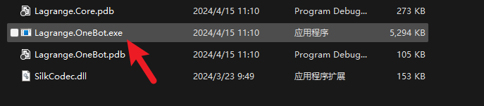
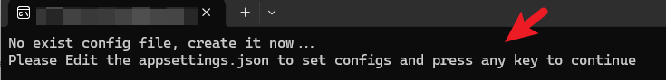
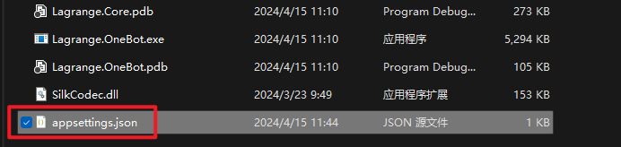
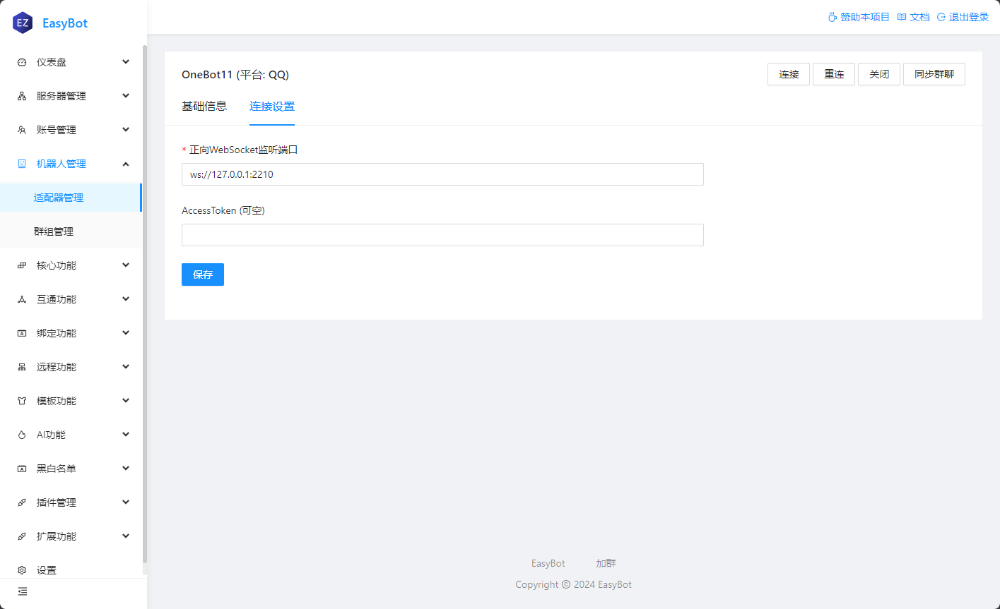

## 下载 or 编译

:::tip 注意
拉格朗只提供 `Nightly Release` 版本，如果你需要最新版本，请自行编译。
:::

| 地址                                                                                                                                | 版本            |
| ----------------------------------------------------------------------------------------------------------------------------------- | --------------- |
| [点我下载](https://github.com/LagrangeDev/Lagrange.Core/releases/download/nightly/Lagrange.OneBot_win-x64_net9.0_SelfContained.zip) | Nightly Release |

### 编译教程

:::tip 注意
小白可以直接使用 `Nightly Release` 版本，无需编译。
:::

:::info 前置条件
**Git** 用于拉取仓库
**.NET 9.0 SDK** 用于编译
:::

```bash
git clone https://github.com/KonataDev/Lagrange.Core.git
cd Lagrange.OneBot

dotnet publish -r win-x64 -c Release -f net9.0
```

### 修改配置

:::info 注意
你需要先启动一次 `Lagrange`，然后才能修改配置。



:::

:::tip 提示

1. `SignServerUrl` 为 Sign 服务器地址，不知道填什么留空即可。
2. `Uin` 为机器人的账号，请自行修改。
   :::

修改配置为如下：

```json
{
  "Logging": {
    "LogLevel": {
      "Default": "Information",
      "Microsoft": "Warning",
      "Microsoft.Hosting.Lifetime": "Information"
    }
  },
  "SignServerUrl": "",
  "Account": {
    "Uin": 000000000,
    "Password": "",
    "Protocol": "Linux",
    "AutoReconnect": true,
    "GetOptimumServer": true
  },
  "Message": {
    "IgnoreSelf": true,
    "StringPost": false
  },
  "QrCode": {
    "ConsoleCompatibilityMode": false
  },
  "Implementations": [
    {
      "Type": "ForwardWebSocket",
      "Host": "127.0.0.1",
      "Port": 2210,
      "HeartBeatInterval": 10000,
      "HeartBeatEnable": true,
      "AccessToken": null
    }
  ]
}
```

## 在主程序配置机器人

:::info 注意
如果上述配置没有更改过      
**地址为** `ws://127.0.0.1:2210/`        
**密钥为** `空`
:::



## 启用群聊

:::info 注意
**EasyBot** 默认全群关闭，需要手动启用


:::