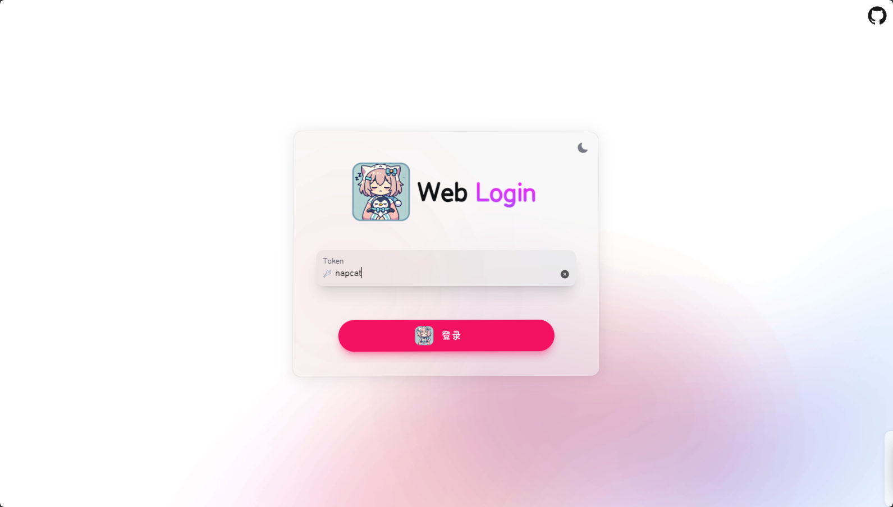
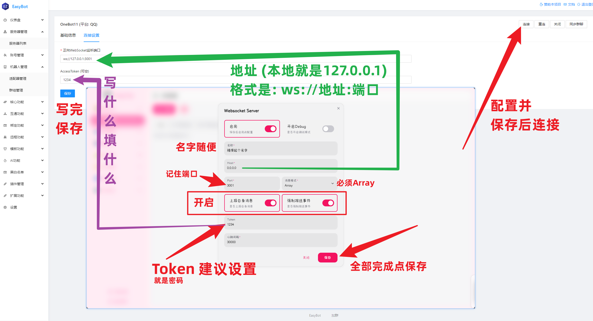

<div align="center">
  

  
</div>

:::tip 环境

#### 请确保您已经安装好以下环境,本教程不演示环境安装过程

- **docker** 用于运行容器
- **docker-compose** 用于管理容器
  :::

## docker-compose 运行

```yml
# docker-compose.yml
version: "3"
services:
  napcat:
    environment:
      - NAPCAT_UID=${NAPCAT_UID}
      - NAPCAT_GID=${NAPCAT_GID}
    ports:
      - 3000:3000
      - 3001:3001
      - 6099:6099
    container_name: napcat
    network_mode: bridge
    restart: always
    image: mlikiowa/napcat-docker:latest
```

## 运行


```bash
NAPCAT_UID=$(id -u) NAPCAT_GID=$(id -g) docker-compose up -d
```

## 登录

登录 WebUI 地址：`http://宿主机ip:6099/webui`

:::tip 默认密码
默认密码是 `napcat`
:::




## 配置

在 NapCat 侧边栏选择网络配置,新建一个`Websocket服务器`


## 在主程序连接

:::info 注意
如果你的宿主机和EasyBot不在同一台机器上，请将`127.0.0.1`设置为宿主机的`IP`
:::



## 启用群聊

:::info 注意
**EasyBot** 默认全群关闭，需要手动启用


:::