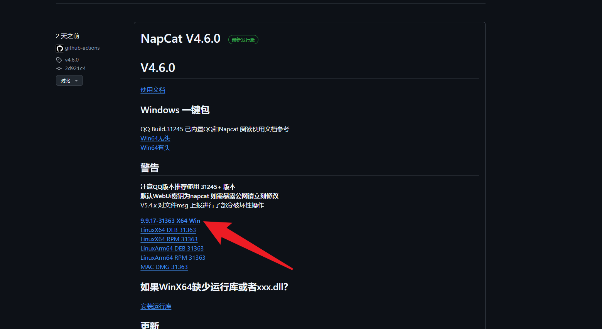
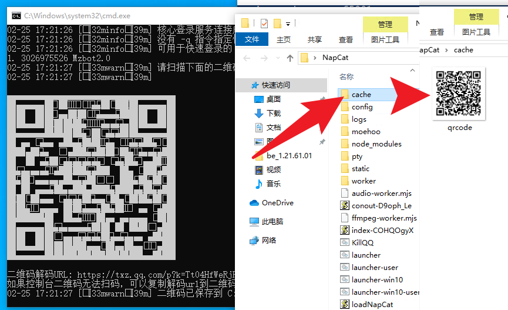
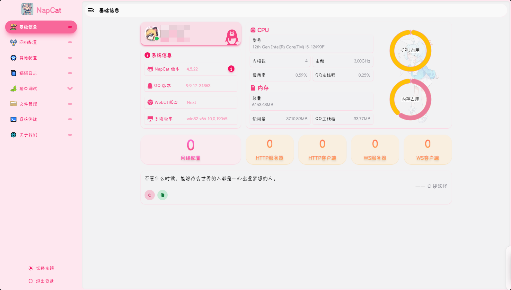
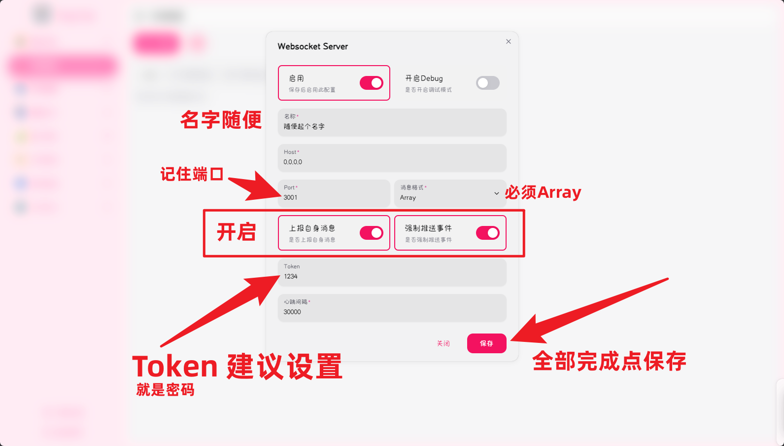
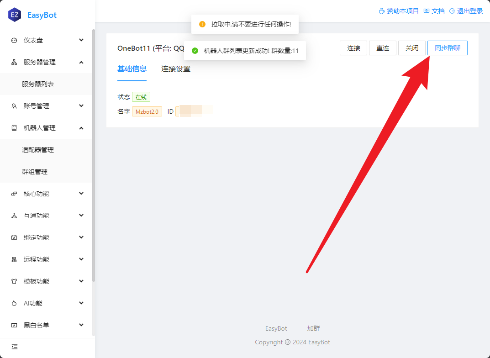
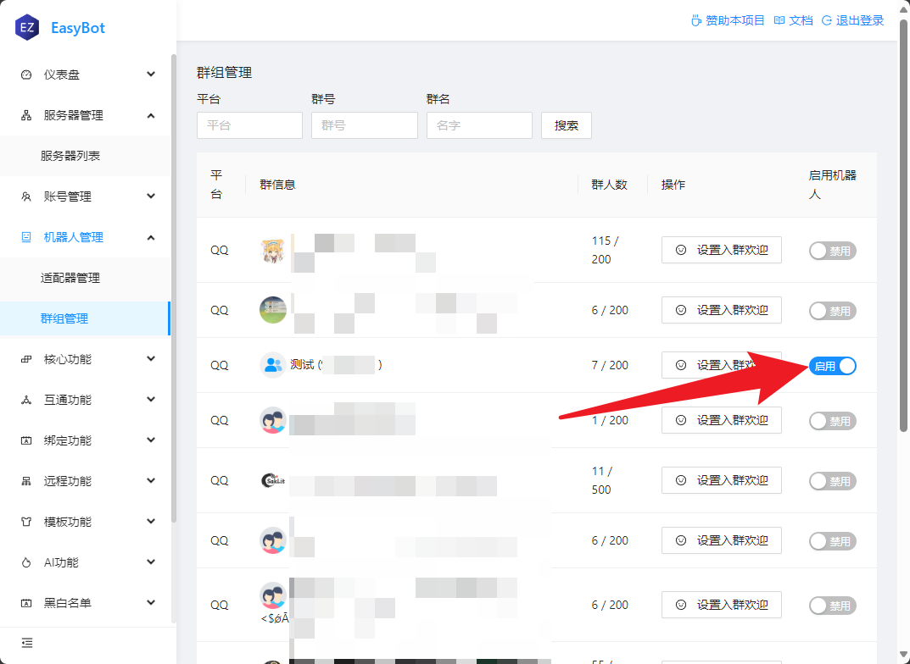

  

  

## 下载

| 节点          | 地址                                                                                                          | 描述                               |
| ------------- | ------------------------------------------------------------------------------------------------------------- | ---------------------------------- |
| Github 最新版 | https://github.com/NapNeko/NapCatQQ/releases                                                                  | 网不好可能打不开                   |
| 镜像          | [点我下载](https://ghproxy.net/https://github.com/NapNeko/NapCatQQ/releases/download/v4.6.0/NapCat.Shell.zip) | 打不开 Github 可以下载             |
| 一键包        | https://share.weiyun.com/CIUHHPos                                                                             | NapCat 官方提供,装好之后打开就能用 |

## 下载选择

打开 Github 的最新版，选择`NapCat.Shell.zip`不要下错了

## 安装

:::info 提示
如果你下载一键包可以跳过此步骤,解压后直接点击`napcat.bat`即可
:::

你需要下载对应版本的`QQ` 这在 NapCat 最新版本有写:

## 启动

一键包点击`napcat.bat`即可,如果使用自己下载的`NapCat.Shell.zip`需要解压后打开`launcher-win10-user.bat`

## 扫码登录

:::info 注意
Win10 或者旧版系统会遇到二维码无法显示的问题  
二维码在 NapCat 根目录下`cache/qrcode.png`

:::

## 管理

NapCat 默认会在`http://127.0.0.1:6099/webui/`启动管理页面,在你的浏览器中打开即可

:::tip 默认密码
默认密码是 `napcat`
:::

## 配置

在 NapCat 侧边栏选择网络配置,新建一个`Websocket服务器`

## 在主程序连接

## 启用群聊

:::info 注意
**EasyBot** 默认全群关闭，需要手动启用

:::