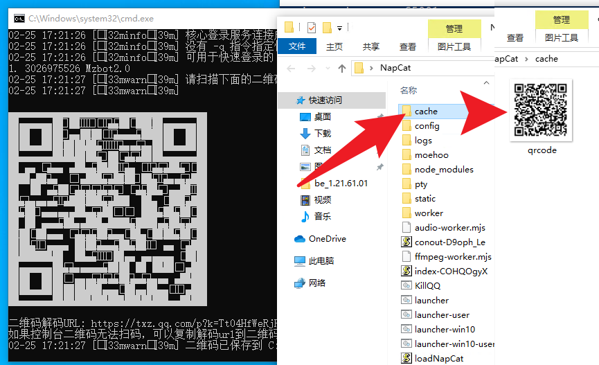
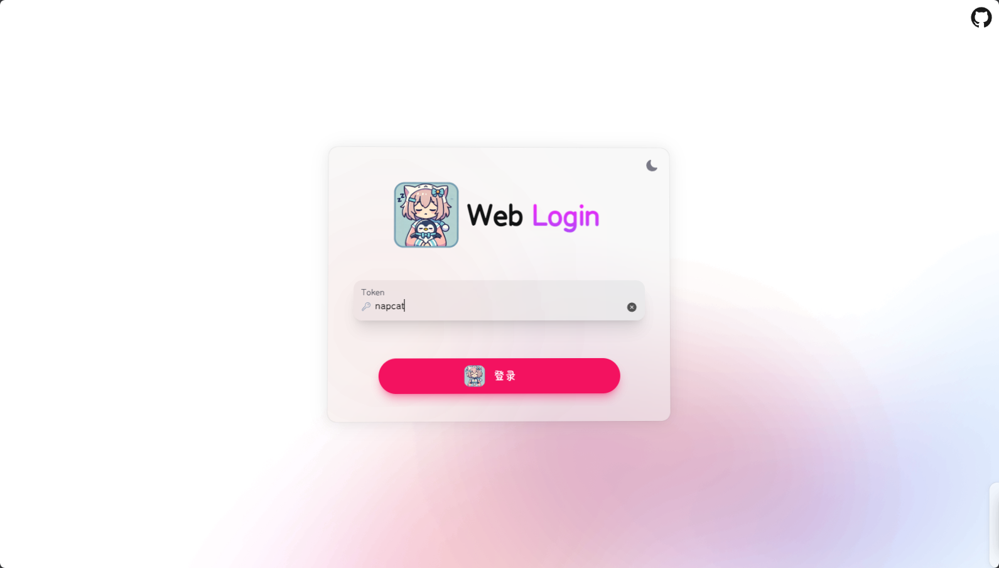
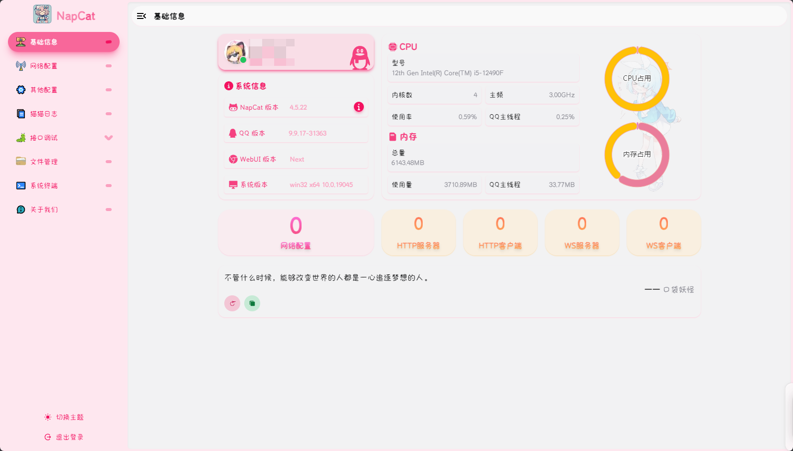
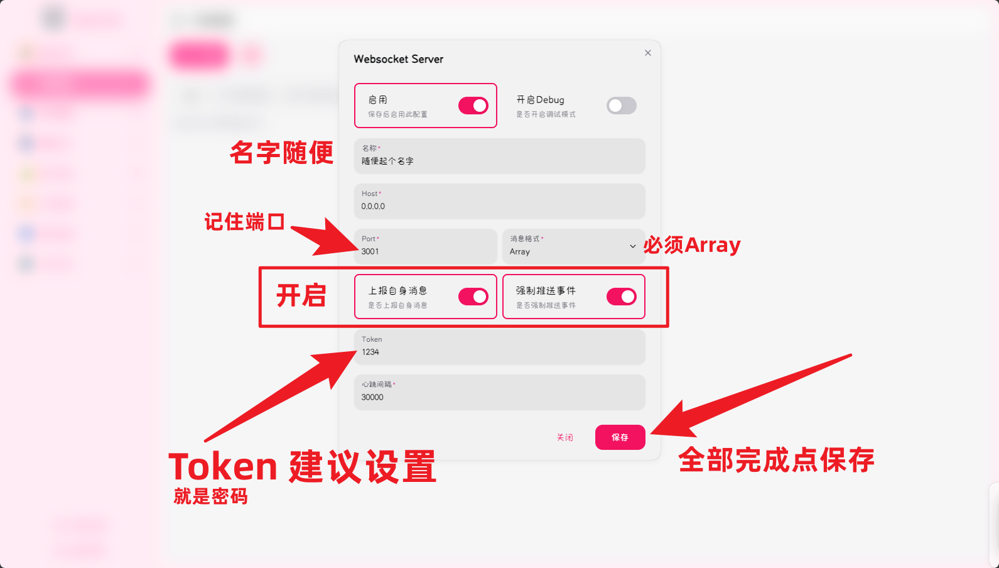
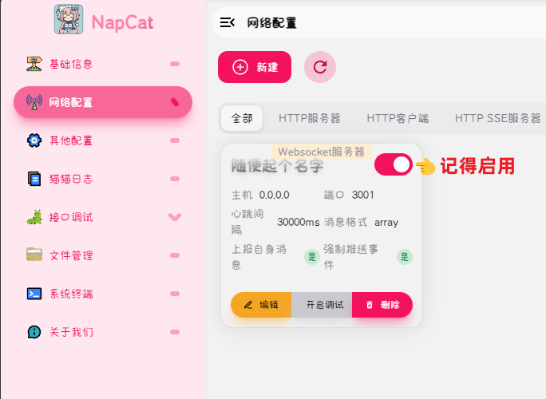
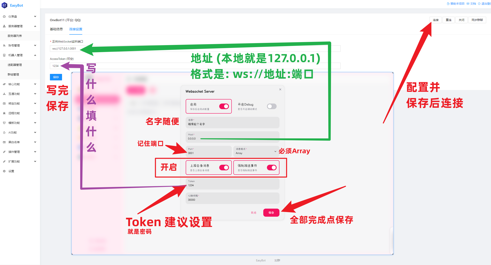
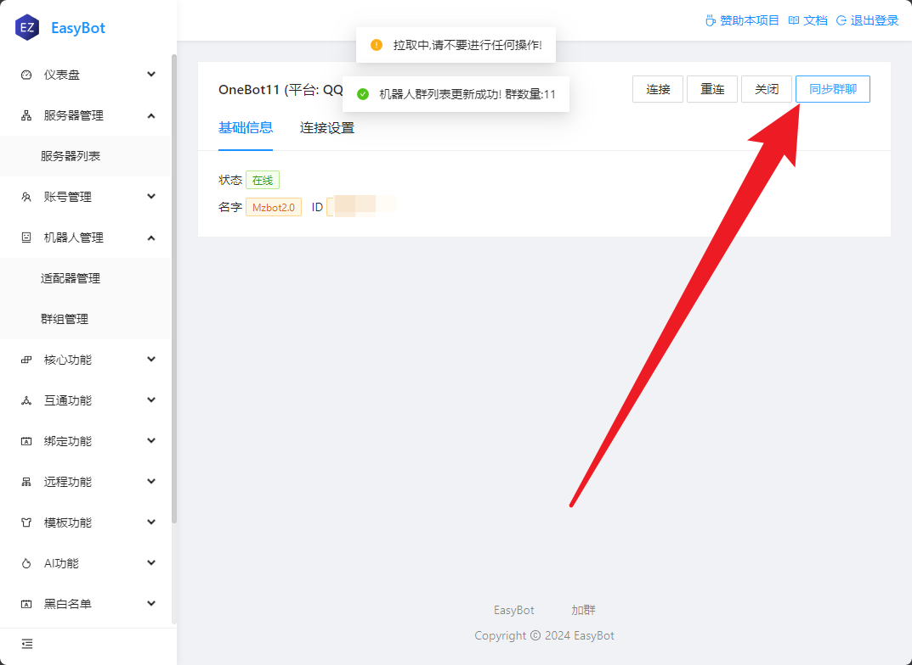
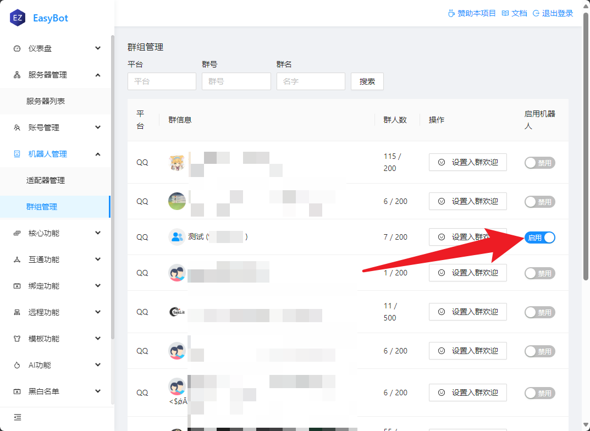

import Tabs from '@theme/Tabs';
import TabItem from '@theme/TabItem';

<center>


</center>

## 下载

| 节点          | 地址                                                                                                          | 描述                               |
| ------------- | ------------------------------------------------------------------------------------------------------------- | ---------------------------------- |
| Github 最新版 | https://github.com/NapNeko/NapCatQQ/releases                                                                  | 网不好可能打不开                   |
| 镜像          | [点我下载](https://ghproxy.net/https://github.com/NapNeko/NapCatQQ/releases/download/v4.7.76/NapCat.Shell.Windows.OneKey.zip) | 打不开 Github 可以下载             |


## 下载选择

打开 Github 的最新版，选择`NapCat.Shell.Windows.OneKey.zip`不要下错了

## 安装
:::info
特殊说明: 一键版仅适用 `Windows.AMD64` 无需安装QQ和NapCat 已内置
:::

:::tip 快速登录
```
NapCatWinBootMain.exe 10001
```
:::
## 扫码登录

:::info 注意
Win10 或者旧版系统会遇到二维码无法显示的问题  
二维码在 NapCat 根目录下`cache/qrcode.png`


:::

## 管理

NapCat 默认会在`http://127.0.0.1:6099/webui/`启动管理页面,在你的浏览器中打开即可

:::tip 默认密码
默认密码是 `napcat`
:::




## 配置

在 NapCat 侧边栏选择网络配置,新建一个`Websocket服务器`




## 在主程序连接



## 启用群聊

:::info 注意
**EasyBot** 默认全群关闭，需要手动启用



:::