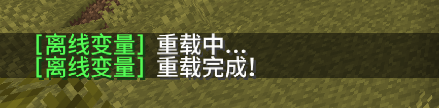

# 配置插件

在服务器安装好插件后，需要配置你想要缓存的变量。

<details>
<summary>配置示例</summary>
```yaml
# 缓存配置
caching:
  # 是否在玩家加入时立刻触发缓存
  on_login: true
  # 是否在玩家退出时立刻触发缓存
  on_logout: true
  # 当玩家在线查询时使用玩家真实的数据，而不是缓存的过期数据
  force_fresh: true
  # 查询玩家真实数据后是否立刻缓存到数据库
  auto_cache: true

# 数据库配置
data_provider:
  # 数据库配置
  # sqlite: 本地数据库 (默认)
  # mysql: MySQL数据库
  type: "sqlite"
  mysql:
    host: "localhost"
    port: 3306
    database: "ez_offline_papi"
    username: "root"
    password: "root"

# 变量配置
# 格式如下
# 变量名(内部查询专用,可以随便起,不要有特殊符号):
#   value:    PAPI变量表达式
#   default:  默认值(当查询失败或玩家从未登录过时生效)
variables:
  # 使用  %ez-offline-papi_死亡次数%
  死亡次数:
    value: '%statistic_deaths%'
    default: '0'
  击杀玩家:
    value: '%statistic_player_kills%'
    default: '0'

```
</details>

## 配置格式

```yaml
# 变量配置
# 格式如下
# 变量名(内部查询专用,可以随便起,不要有特殊符号):
#   value:    PAPI变量表达式
#   default:  默认值(当查询失败或玩家从未登录过时生效)
variables:
  # 使用  %ez-offline-papi_死亡次数%
  死亡次数:
    value: '%statistic_deaths%'
    default: '0'
  击杀玩家:
    value: '%statistic_player_kills%'
    default: '0'
````

## 重载

配置好后使用`/ezofflinepapi reload`命令重载插件。



## 使用

你可以使用`%ez-offline-papi_变量名%`来使用变量, 例如刚才配置的:

- `%ez-offline-papi_死亡次数%`
- `%ez-offline-papi_击杀玩家%`
