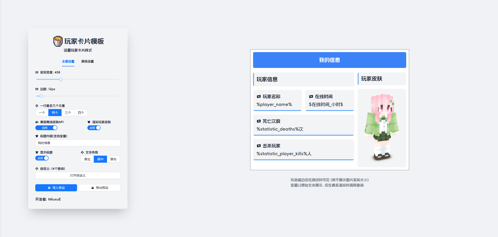
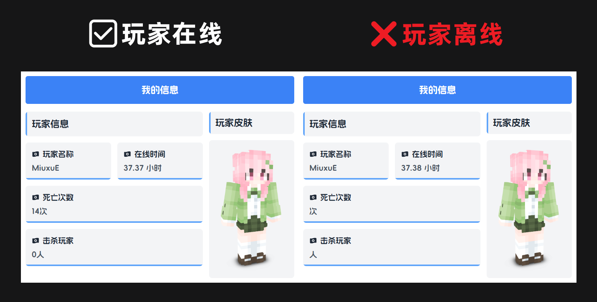
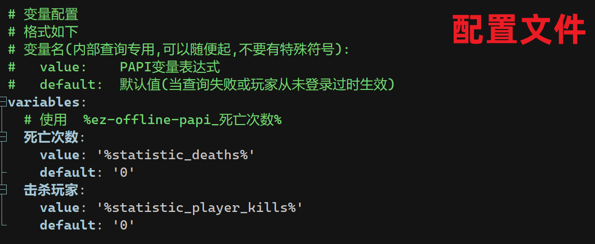
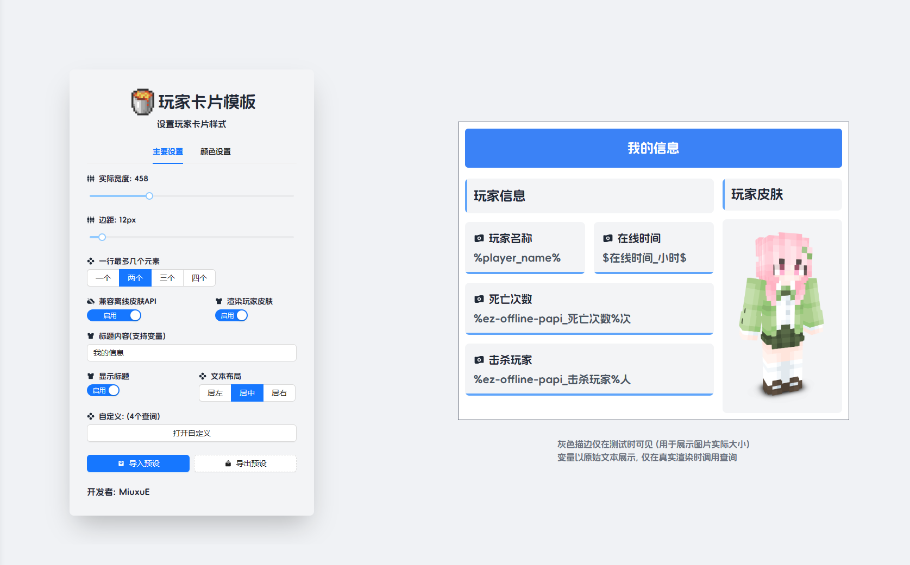
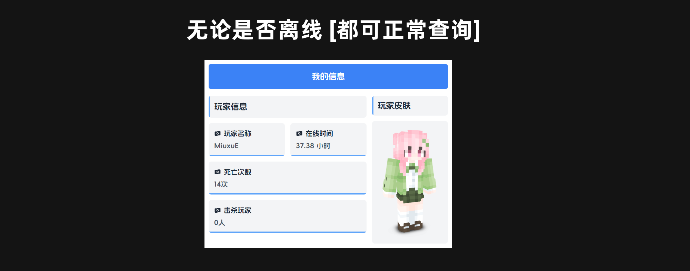

import Tabs from "@theme/Tabs";
import TabItem from "@theme/TabItem";

:::info 为什么
一些 PAPI 变量在玩家离线时无法工作，导致一些查询业务遇到问题。  
:::

:::info 解决
本插件专为解决 PAPI 变量离线查询痛点设计的轻量化解决方案，通过数据库缓存机制实现变量数据全时域调用，完美突破传统变量插件的在线依赖限制。
:::

## 特点

### 离线数据持久化

> 通过配置智能同步变量到数据库，无论在线皆可查询。

### 深度定制支持

> 通过配置文件可自定义缓存变量。

### 本地远程支持

> 支持本地(SQLite)和远程(MySQL)数据库。

## 前置插件

- [PlaceholderAPI](https://www.spigotmc.org/resources/placeholderapi.6245/) 插件

## 应用场景

<Tabs className="unique-tabs">
  <TabItem value="EasyBot图片模板">
    ### 未使用离线变量 
    
    

    ### 使用离线变量
    
    
    
  </TabItem>
</Tabs>
